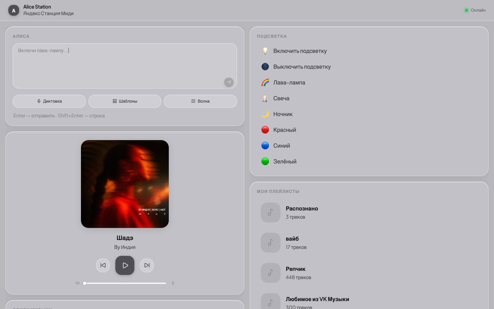
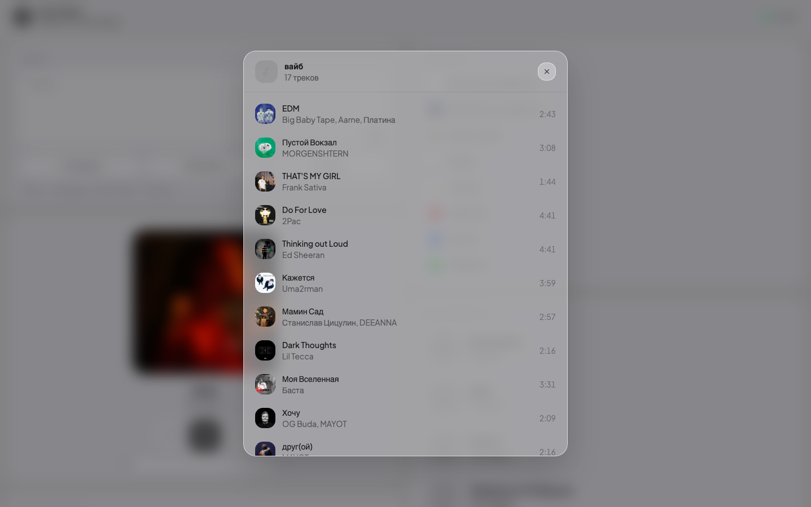

# 🎙️ Alice Station Control

> **Web UI to control Yandex Station (Alice) from any device on your home network** — no phone, no voice commands needed.

**[🇷🇺 Русская версия ниже](#-русская-версия)**



---

## ✨ Features

- 🎵 **Player** — play/pause, next/prev track, album art with ambient glow
- 🔊 **Volume** — real-time slider control (~20ms response)
- 🎤 **Voice input** — dictate commands via microphone (Web Speech API)
- 💬 **Text commands** — send any command to Alice
- 📋 **Templates** — one-click quick commands
- 💡 **Lighting** — lava lamp, candle, night light, colors (official Midi modes)
- 🎵 **Playlists** — browse, search tracks, start playback



- 🔍 **Music search** — search and play tracks from Yandex Music
- 🚀 **Auto-start** — server launches automatically when connected to home network

---

## 🛠️ Tech Stack

**Backend**
- Python 3.10+ · FastAPI · uvicorn
- [yandex-music](https://github.com/MarshalX/yandex-music-api) — playlists, search, tracks
- [YandexStation](https://github.com/AlexxIT/YandexStation) — device control via Glagol WebSocket
- Persistent WebSocket — ~20ms response vs ~1000ms with HTTP polling

**Frontend**
- React 19 · Vite · Tailwind CSS v4
- [Motion](https://motion.dev/) — animations (stagger, spring, ambient glow)
- [shadcn/ui](https://ui.shadcn.com/) · Lucide React
- Design: liquid glass, Plus Jakarta Sans

---

## 📋 Requirements

- macOS (auto-start via launchd)
- Python 3.10+
- Node.js 18+
- Yandex Station on the same local network
- Yandex account with Yandex Plus subscription

---

## 🚀 Installation

### 1. Clone

```bash
git clone https://github.com/pluGGsee/alice-station-control.git
cd alice-station-control
```

### 2. Backend

```bash
cd work/backend
python3 -m venv venv
source venv/bin/activate
pip install -r requirements.txt
```

### 3. Yandex Auth

Create `work/backend/config.py` (never committed):

```python
YANDEX_TOKEN = ""      # Yandex Music token (see below)
YANDEX_XTOKEN = ""     # Yandex Passport x-token (see below)
SESSION_ID = ""        # Session_id cookie from browser
SESSION_ID2 = ""       # sessionid2 cookie from browser

STATION_IP = "192.168.X.X"    # Station IP on local network
STATION_PORT = 1961
DEVICE_ID = ""         # auto-discovered
PLATFORM = "cucumber"  # for Yandex Station Midi
```

**Get YANDEX_TOKEN:**
```bash
source venv/bin/activate
python3 get_token.py
```

**Get YANDEX_XTOKEN:**
Open in browser:
```
https://oauth.yandex.ru/authorize?response_type=token&client_id=23cabbbdc6cd418abb4b39c32c41195d
```
Copy `access_token` from the redirect URL.

**Get SESSION_ID / SESSION_ID2:**
DevTools → Application → Cookies → `yandex.ru`

### 4. Frontend

```bash
cd work/frontend
npm install
```

### 5. Run

```bash
# Backend
cd work/backend && source venv/bin/activate
uvicorn main:app --host 0.0.0.0 --port 8000

# Frontend (dev)
cd work/frontend
npm run dev
```

Open: **http://localhost:5174**

From another device: **http://\<your-ip\>:8000**

---

## ⚙️ Auto-start on Mac

Server starts automatically at login, only when connected to home network:

```bash
cp assets/notes/com.alice-station.server.plist ~/Library/LaunchAgents/
cp assets/notes/com.alice-station.network-watch.plist ~/Library/LaunchAgents/
cp assets/notes/start-server.sh ~/.local/bin/alice-station-start.sh
chmod +x ~/.local/bin/alice-station-start.sh

# Edit HOME_SUBNET in start-server.sh to match your subnet

launchctl load ~/Library/LaunchAgents/com.alice-station.server.plist
launchctl load ~/Library/LaunchAgents/com.alice-station.network-watch.plist

# Logs
tail -f ~/Library/Logs/alice-station.log
```

Idle load: **~0.1% CPU, ~30 MB RAM**.

---

## 📁 Project Structure

```
alice-station-control/
├── work/
│   ├── backend/          # Python FastAPI server
│   │   ├── main.py       # API endpoints
│   │   ├── station.py    # Station control (Glagol WebSocket)
│   │   ├── music.py      # Yandex Music (playlists, search)
│   │   ├── config.py     # Tokens & settings (not in git!)
│   │   └── requirements.txt
│   └── frontend/         # React app
│       └── src/
│           ├── App.jsx
│           └── components/
├── assets/
│   ├── screenshots/      # UI screenshots
│   ├── references/       # Design references
│   └── notes/            # Auto-start scripts
├── CLAUDE.md
└── README.md
```

---

## 🔑 Notes

- `config.py` is in `.gitignore` — **never commit your tokens**
- Tokens expire every few weeks — refresh `SESSION_ID` from browser on 401 errors
- Service works on local network only — not exposed to the internet

---

## 🗺️ Roadmap (v2)

- [ ] Schedules & timers
- [ ] Smart home control (Zigbee)
- [ ] Command history
- [ ] Dark theme
- [ ] Docker (one-command deploy on Windows)

---

## 📄 License

MIT — do whatever you want.

---

---

# 🇷🇺 Русская версия

> Локальный веб-сервис для управления **Яндекс Станцией Миди** с любого устройства в домашней сети — без телефона и голосовых команд.


---

## ✨ Возможности

- 🎵 **Плеер** — play/pause, следующий/предыдущий трек, обложка с ambient glow
- 🔊 **Громкость** — управление ползунком в реальном времени (~20ms отклик)
- 🎤 **Голосовой ввод** — диктовка команд через микрофон (Web Speech API)
- 💬 **Текстовые команды** — отправить любую команду Алисе
- 📋 **Шаблоны** — быстрые команды одним кликом
- 💡 **Подсветка** — лава-лампа, свеча, ночник, цвета (официальные режимы Миди)
- 🎵 **Плейлисты** — просмотр, поиск треков, запуск


- 🔍 **Поиск музыки** — поиск и запуск треков с Яндекс Музыки
- 🚀 **Автозапуск** — сервер стартует автоматически при подключении к домашней сети

---

## 🛠️ Технологии

**Бэкенд**
- Python 3.10+ · FastAPI · uvicorn
- [yandex-music](https://github.com/MarshalX/yandex-music-api) — плейлисты, поиск, треки
- [YandexStation](https://github.com/AlexxIT/YandexStation) — управление колонкой через Glagol WebSocket
- Persistent WebSocket — отклик ~20ms вместо ~1000ms с HTTP

**Фронтенд**
- React 19 · Vite · Tailwind CSS v4
- [Motion](https://motion.dev/) — анимации (stagger, spring, ambient glow)
- [shadcn/ui](https://ui.shadcn.com/) · Lucide React
- Дизайн: liquid glass, шрифт Plus Jakarta Sans

---

## 📋 Требования

- macOS (автозапуск через launchd)
- Python 3.10+
- Node.js 18+
- Яндекс Станция в той же локальной сети
- Аккаунт Яндекс с подпиской Плюс

---

## 🚀 Установка

### 1. Клонировать

```bash
git clone https://github.com/pluGGsee/alice-station-control.git
cd alice-station-control
```

### 2. Бэкенд

```bash
cd work/backend
python3 -m venv venv
source venv/bin/activate
pip install -r requirements.txt
```

### 3. Авторизация Яндекс

Создай `work/backend/config.py` (не коммитится):

```python
YANDEX_TOKEN = ""      # токен Яндекс Музыки (см. ниже)
YANDEX_XTOKEN = ""     # x-token Яндекс Паспорта (см. ниже)
SESSION_ID = ""        # кука Session_id из браузера
SESSION_ID2 = ""       # кука sessionid2 из браузера

STATION_IP = "192.168.X.X"    # IP колонки в локальной сети
STATION_PORT = 1961
DEVICE_ID = ""         # ID устройства (найдёт автоматически)
PLATFORM = "cucumber"  # для Станции Миди
```

**Получить YANDEX_TOKEN:**
```bash
source venv/bin/activate
python3 get_token.py
```

**Получить YANDEX_XTOKEN:**
Открой в браузере:
```
https://oauth.yandex.ru/authorize?response_type=token&client_id=23cabbbdc6cd418abb4b39c32c41195d
```
Скопируй `access_token` из URL после редиректа.

**Получить SESSION_ID / SESSION_ID2:**
DevTools браузера → Application → Cookies → `yandex.ru`

### 4. Фронтенд

```bash
cd work/frontend
npm install
```

### 5. Запуск

```bash
# Бэкенд
cd work/backend && source venv/bin/activate
uvicorn main:app --host 0.0.0.0 --port 8000

# Фронтенд (разработка)
cd work/frontend
npm run dev
```

Открой: **http://localhost:5174**

С другого устройства: **http://\<IP-компьютера\>:8000**

---

## ⚙️ Автозапуск на Mac

```bash
cp assets/notes/com.alice-station.server.plist ~/Library/LaunchAgents/
cp assets/notes/com.alice-station.network-watch.plist ~/Library/LaunchAgents/
cp assets/notes/start-server.sh ~/.local/bin/alice-station-start.sh
chmod +x ~/.local/bin/alice-station-start.sh

# Отредактируй HOME_SUBNET в start-server.sh под свою подсеть

launchctl load ~/Library/LaunchAgents/com.alice-station.server.plist
launchctl load ~/Library/LaunchAgents/com.alice-station.network-watch.plist

# Логи
tail -f ~/Library/Logs/alice-station.log
```

Нагрузка в idle: **~0.1% CPU, ~30 МБ RAM**.

---

## 📁 Структура проекта

```
alice-station-control/
├── work/
│   ├── backend/          # Python FastAPI сервер
│   │   ├── main.py       # API эндпоинты
│   │   ├── station.py    # Управление колонкой (Glagol WebSocket)
│   │   ├── music.py      # Яндекс Музыка (плейлисты, поиск)
│   │   ├── config.py     # Токены и настройки (не в git!)
│   │   └── requirements.txt
│   └── frontend/         # React приложение
│       └── src/
│           ├── App.jsx
│           └── components/
├── assets/
│   ├── screenshots/      # Скриншоты UI
│   ├── references/       # Референсы дизайна
│   └── notes/            # Скрипты автозапуска
├── CLAUDE.md
└── README.md
```

---

## 🔑 Важно

- `config.py` в `.gitignore` — **никогда не коммить токены**
- Токены протухают раз в несколько недель — обновляй `SESSION_ID` из браузера при ошибках 401
- Сервис работает только в локальной сети — снаружи недоступен

---

## 🗺️ Планы (v2)

- [ ] Расписание и таймеры
- [ ] Управление умным домом (Zigbee)
- [ ] История команд
- [ ] Тёмная тема
- [ ] Docker (деплой на Windows одной командой)

---

## 📄 Лицензия

MIT — делай что хочешь.
